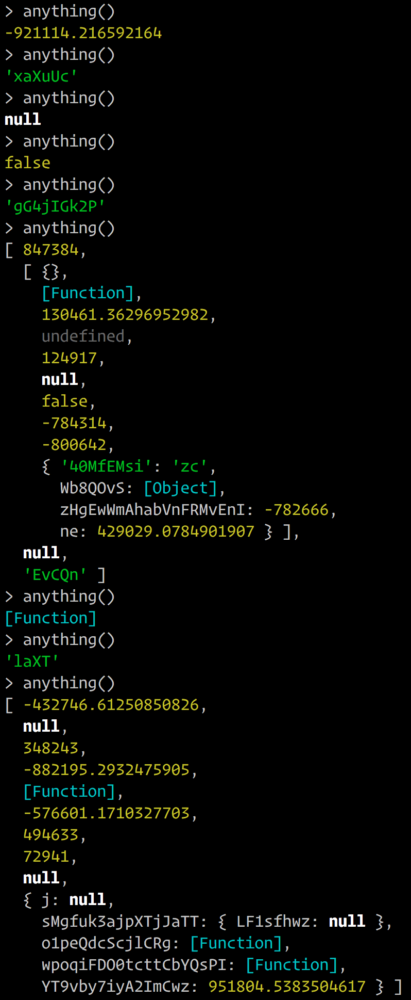

# Anything ¯\\\_(ツ)_/¯

This module allows you to generate completely random variables, which is sometimes useful in testing.
There are situations when you want to write a little property-based test, but you don't want to
use a full framework for that.

That's where **Anything** comes in.

**Anything** is a tiny, zero-dependency utility for generating random stuff.

## Anything in a nutshell



## Installation

Install it with yarn:
```sh
yarn add -D any-thing
```

Or, if you use npm:
```sh
npm install --save-dev any-thing
```

## Usage

An example of usage with Jest:
```js
import _ from 'lodash'
import { anything } from 'any-thing'

test('makeOkResponse', () => {
  /* a tiny property-based test */
  _.times(100, () => {
    const thing = anything()
    expect(makeOkResponse(thing)).toEqual({ status: "OK", payload: thing })
  })
})
```

**Anything** includes 9 generators, which produce, respectively:

- Arrays
- Booleans
- Functions
- Integers
- Numbers (floats)
- Objects
- Strings
- `null`
- `undefined`

Arrays, functions and objects may also be nested.

## API

### `anything(options = {})`

Generates anything. You may provide options for each generator.
Options is an object that contains options for all (or some) generators. The overall shape is:
```js
{
  array: { /* array options */ },
  boolean: { /* boolean options */ },
  function: { /* function options */ },
  integer: { /* integer options */ },
  /* and so on for other generators */
}
```
See also: [Generator options](#generator-options).

### `anything.but(generators..., options = {})`

Generates anything, but does not use specified generators. For example, `anything.but(Array, Object)` will generate anything but an array or an object.

### `anything.except(generators..., options = {})`

Alias for `anything.but`.

### `anything.from(generators..., options = {})`

Generates anything using a whitelist of generators. For example, `anything.from(null, undefined)` will return either `null` or `undefined`.

### Specific generators

There's also a function for each generator:
- `anyArray()`
- `anyBoolean()`
- `anyFunction()`
- `anyInteger()`
- `anyNumber()`
- `anyObject()`
- `anyString()`

These functions accept options, which are specific for each generator.

## Generator options

### Array

- `minLength`: minimum length of the array. Default: 0
- `maxLength`: maximum length of the array. Default: 10
- `maxDepth`: maximum depth ("nestedness") of the array. Default: 3

Example:
```js
anyArray({ minLength: 1, maxLength: 2, maxDepth: 2 })
// => [ -923712 ]
```

### Boolean

This generator doesn't have any options.

Example:
```js
anyBoolean()
// => true
```

### Function

- `maxDepth`: maximum depth of the function. Default: 3

Example:
```js
anyFunction({ maxDepth: 2 })
// => function () { return 23123 }
```

### Integer

- `min`: minimum value. Default: -1,000,000
- `max`: maximum value. Default: 1,000,000

Example:
```js
anyInteger({ min: 0, max: 42 })
// => 42
// i knew I'd get 42
// what else could it be
```

### Number (float)

- `min`: minimum value. Default: -1,000,000
- `max`: maximum value. Default: 1,000,000

Example:
```js
anyNumber({ min: 0, max: 42 })
// => 30.172931281536908
```

### String

- `minLength`: minimum length. Default: 0
- `maxLength`: maximum length. Default: 10
- `alphabet`: characters to use when generating a stirng. May be a string or an array.
Default: `ABCDEFGHIJKLMNOPQRSTUVWXYZabcdefghijklmnopqrstuvwxyz0123456789`

Example:
```js
anyString({ minLength: 10, maxLength: 30, alphabet: '(!*@#!@ )' })
// => '! @ !#*(!*@)('
```

### Object

- `minLength`: minimum object length (number of entries). Default: 0
- `maxLength`: maximum object length. Default: 10
- `maxDepth`: maximum object depth. Default: 3
- `minStringLength`: minimum length of keys. Default: 1
- `maxStringLength`: maximum length of keys. Default: 20
- `alphabet`: alphabet to use when generating keys. Defaults to String generator's default

Example:
```js
anyObject({
  minLength: 0,
  maxLength: 2,
  maxDepth: 1,
  minStringLength: 1,
  maxStringLength: 4,
  alphabet: '!@#$%^'
})
// => {}
// of course that's what I get
// rng often seems like it's not random at all
```
